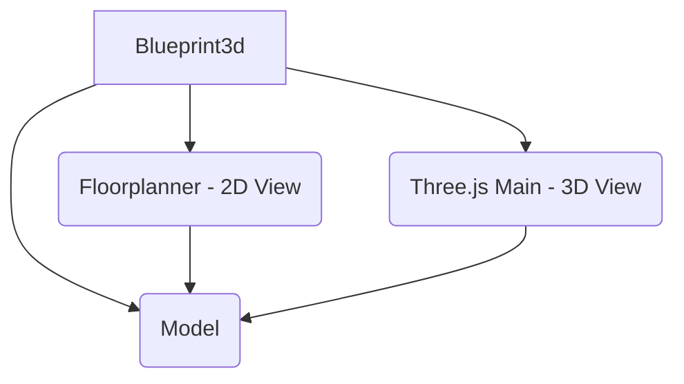

# Blueprint3D Documentation

Welcome to the developer documentation for Blueprint3D. This documentation is intended for developers who want to extend or modify the functionality of the application.

## Architectural Overview

Blueprint3D is a TypeScript application for designing interior spaces. The application is structured into several key modules, each responsible for a specific part of the functionality. The overall architecture is designed to be modular, with a clear separation of concerns between the data model, the 2D floor planner, and the 3D view.

The core of the application is the `Blueprint3d` class, which initializes and connects the other main components. The architecture can be visualized with the following diagram:

### Modules

The codebase is organized into the following main modules, located in the `src/` directory:

*   **[Core](./core.md):** Contains basic utilities and core functionalities like logging, configuration, and dimensioning.
*   **[Model](./model.md):** Represents the data model for the entire application, including the floor plan and the items within it. It acts as the single source of truth.
*   **[Floorplanner](./floorplanner.md):** The 2D view for creating and editing the floor plan. It allows users to draw walls, place doors, and arrange furniture from a top-down perspective.
*   **[Three](./three.md):** The 3D view, built on top of `three.js`. It renders the floor plan and the items in a 3D environment, allowing users to visualize the space.
*   **[Items](./items.md):** Defines the various types of items that can be placed in the scene, such as furniture, windows, and doors.

This documentation will provide more detailed information about each of these modules and their public APIs.
