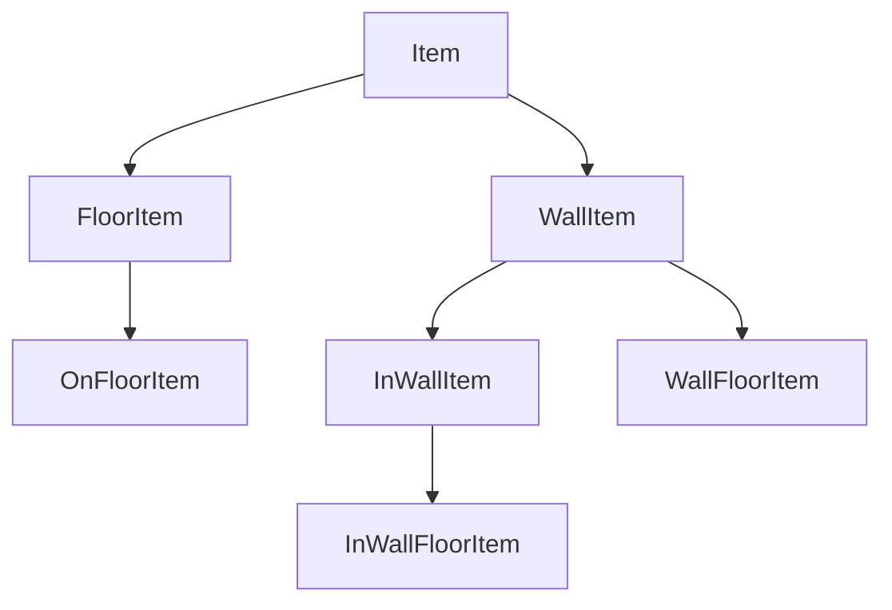

# Items Module

The `items` module defines the various types of objects that can be placed within the 3D scene. It provides a class hierarchy for different categories of items, such as those placed on the floor, attached to walls, or embedded within walls.

## Item Class Hierarchy

The items are organized into a class hierarchy, with the abstract `Item` class at the root. The hierarchy is designed to share common functionality and enforce specific behaviors for each type of item.

-   **`Item`**: The abstract base class for all items. It provides core functionalities like selection, movement, rotation, and resizing.
-   **`FloorItem`**: An abstract class for items that are placed on the floor. It ensures that items stay within room boundaries and on the floor plane.
-   **`OnFloorItem`**: For items that sit on the floor, like furniture.
-   **`WallItem`**: An abstract class for items that are attached to walls. It handles logic for finding and attaching to the nearest wall.
-   **`InWallItem`**: For items that are placed *inside* a wall, such as windows.
-   **`WallFloorItem`**: For items that are attached to a wall and also rest on the floor, like a bookshelf.
-   **`InWallFloorItem`**: For items that are both within a wall and touch the floor, such as doors.

---

## `Item` Class (Abstract)

The base class for all scene objects.

### Public Methods

-   **`remove(): void`**: Removes the item from the scene.
-   **`resize(height: number, width: number, depth: number): void`**: Resizes the item.
-   **`setScale(x: number, y: number, z: number): void`**: Sets the scale of the item.
-   **`setSelected(): void`** / **`setUnselected(): void`**: Sets the selection state of the item.
-   **`mouseOver(): void`** / **`mouseOff(): void`**: Handles mouse hover events.
-   **`rotate(intersection): void`**: Rotates the item based on user input.
-   **`moveToPosition(vec3, intersection): void`**: Moves the item to a new position.
.

---

## `Metadata` Interface

The `Metadata` interface defines the structure for data that describes an item.

-   **`itemName: string`**: The name of the item.
-   **`itemType: number`**: The type of the item, used by the factory to create the correct class.
-   **`modelUrl: string`**: The URL of the 3D model for the item.
-   **`resizable: boolean`**: A flag indicating if the item can be resized.

---

## `Factory` Class

The `Factory` class is used to create instances of different item types.

### Public Static Methods

-   **`getClass(itemType: number): (typeof Item)`**
    -   Retrieves the class constructor for a given item type.
    -   **Parameters:**
        -   `itemType`: The type of the item.
    -   **Returns:** The class constructor for the specified item type.
