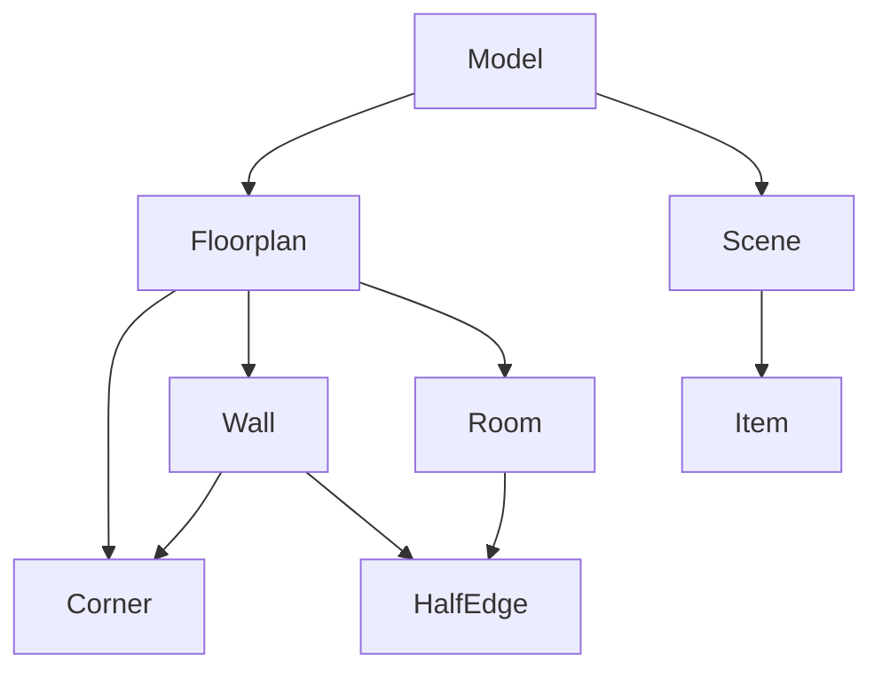

# Model Module

The `model` module is the core of the Blueprint3D application, defining the data structures that represent the entire scene, from the 2D floor plan to the 3D objects. It acts as the single source of truth for the application's state.

## Core Classes

The model is composed of several key classes that work together to represent the design.

-   **`Model`**: The top-level class that encapsulates the entire design, holding references to the `Floorplan` and the `Scene`.
-   **`Floorplan`**: Manages the 2D floor plan data, including all the `Walls`, `Corners`, and `Rooms`. It provides methods for creating, modifying, saving, and loading the floor plan.
-   **`Scene`**: Manages the collection of 3D `Items` in the scene. It handles the loading of 3D models and adding or removing items from the Three.js scene.
-   **`Room`**: Represents a closed area in the floor plan, defined by a cycle of `Corners`.
-   **`Wall`**: Represents a wall connecting two `Corners`.
-   **`Corner`**: Represents a point where `Walls` meet.
-   **`HalfEdge`**: Represents one of the two faces of a `Wall`, used internally to define the boundaries of a `Room`.

---

## `Model` Class

The main container for the application's data.

### Public Properties

-   **`floorplan: Floorplan`**: The `Floorplan` object representing the 2D layout.
-   **`scene: Scene`**: The `Scene` object managing the 3D items.

---

## `Floorplan` Class

Manages the structure of the 2D floor plan.

### Public Methods

-   **`newWall(start: Corner, end: Corner): Wall`**: Creates a new wall between two corners.
-   **`newCorner(x: number, y: number, id?: string): Corner`**: Creates a new corner at a given position.
-   **`getWalls(): Wall[]`**: Returns an array of all walls in the floor plan.
-   **`getCorners(): Corner[]`**: Returns an array of all corners.
-   **`getRooms(): Room[]`**: Returns an array of all rooms.
-   **`saveFloorplan(): object`**: Serializes the floor plan data to a JSON object.
-   **`loadFloorplan(floorplan: object): void`**: Loads a floor plan from a JSON object.

---

## `Scene` Class

Manages the 3D objects in the scene.

### Public Methods

-   **`addItem(...)`**: Creates an item from a 3D model and adds it to the scene.
-   **`removeItem(item: Item): void`**: Removes an item from the scene.
-   **`getItems(): Item[]`**: Returns an array of all items in the scene.

---

## Key Mechanisms

### Data-Binding and Synchronization

The Blueprint3D application keeps the 2D floor planner and the 3D view synchronized through a centralized data model and an event-driven callback system. The `Model` class holds the `Floorplan` and `Scene` objects, which act as the single source of truth for the application's state.

When a change is made to the floor plan (e.g., a wall is moved in the 2D editor), the following sequence of events occurs:

1.  The user interaction is handled by the `Floorplanner` controller, which calls the appropriate method on the `Floorplan` object (e.g., `wall.move()`).
2.  The `Floorplan` object updates its internal state (e.g., the position of the corners of the wall).
3.  The `Floorplan` then fires a callback (e.g., `moved_callbacks`) to notify any listeners that a change has occurred.
4.  Both the `FloorplannerView` (for the 2D canvas) and the `Floorplan` object in the `three` module (for the 3D view) subscribe to these callbacks.
5.  Upon receiving the callback, both views update themselves to reflect the new state of the model. The `FloorplannerView` redraws the 2D canvas, and the `three.Floorplan` rebuilds the 3D meshes for the walls and floors.

This one-way data flow from the model to the views ensures that all representations of the design are consistent.

### Room Detection Algorithm

The application automatically detects rooms from the arrangement of walls and corners. This is handled by the `findRooms` method in the `Floorplan` class. The algorithm works as follows:

1.  **Graph Representation**: The floor plan is treated as a planar straight-line graph, where the `Corners` are the vertices and the `Walls` are the edges.
2.  **Cycle Finding**: The algorithm traverses this graph to find the smallest possible cycles. A cycle represents a closed loop of walls, which forms a potential room.
3.  **Tightest Cycle Search**: For each corner and each of its adjacent corners, the algorithm performs a search to find the "tightest" cycle—the one that encloses the smallest area. This is done using a graph traversal algorithm that prioritizes paths with the smallest turning angles.
4.  **Filtering and Orientation**: The algorithm finds many potential cycles. It filters out duplicate cycles and ensures that the remaining cycles are oriented counter-clockwise (CCW), which is a common convention for defining interior spaces.
5.  **Room Creation**: Each of the resulting unique, CCW cycles is considered a room, and a `Room` object is created for it. The `Room` object then uses its list of corners to create `HalfEdge`s, which define the interior boundaries of the room.
